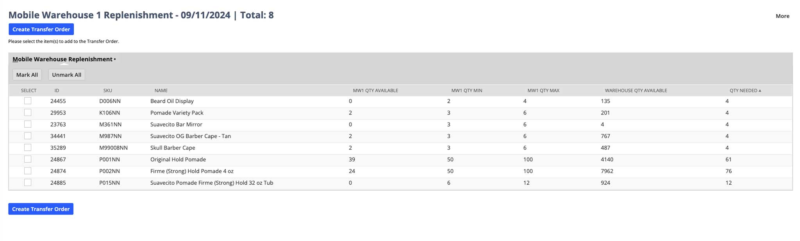

# Mobile Warehouse Replenishment

> A NetSuite SuiteLet to automate Transfer Orders between the Main Warehouse and a Mobile Warehouse

	

## Dependencies

Create a directory named `MW1 Replenishment` in the SuiteScripts directory. This will hold all the scripts necessary for this SuiteLet.

The SuiteLet depends on 2 other scripts, these scripts must be saved in the same directory as the SuiteLet.

<table>
  <thead>
    <tr>
      <th>Name</th>
      <th>Path</th>
      <th>Description</th>
    </tr> 
  </thead>
  <tbody>
    <tr>
      <td>createTransferOrder.ts</td>
      <td>SuiteScripts/MW1 Replenishment/createTransferOrder.js</td>
      <td>This script creates the Transfer Order from the SuiteLet output</td>
    </tr> 
    <tr>
      <td>mobile_warehouse_replenishment_client.ts</td>
      <td>SuiteScripts/MW1 Replenishment/mobile_warehouse_replenishment_client.js</td>
      <td>This client script handles all user events, like selecting individual items to transfer</td>
    </tr> 
  </tbody>
</table>

Search:

- The following search uses RF-Smarts Bin Enhancement Records. It uses the min / max to calculate the quantities to transfer from the Main Warehouse.

Create the following Search

<table>
  <thead>
    <tr>
      <th>Type</th>
      <th>Internal ID</th>
      <th>Name</th>
    </tr>
  </thead>
  <tbody>
    <tr>
      <td>Item</td>
       <td>customsearch_sp_mobile_w_1_rf_smart</td>
       <td>SP - Mobile Warehouse Replenishment via RF-Smart Bin Enhancement</td>
    </tr>
  </tbody>
</table>

Criteria: Standard

- Use Expressions

<table>
  <thead>
    <tr>
      <th>Not</th>
      <th>Parens</th>
      <th>Filter</th>
      <th>Description</th>
      <th>Formula</th>
      <th>Parens</th>
      <th>And / Or</th>
    </tr>
  </thead>
  <tbody>
    <tr>
      <td></td>
      <td></td>
      <td>Inventory Location</td>
      <td>is Mobile Warehouse 1</td>
      <td></td>
      <td></td>
      <td>And</td>
    </tr>
    <tr>
      <td></td>
      <td></td>
      <td>Formula (Numberic)</td>
      <td>is 1</td>
      <td>CASE WHEN {custrecord_rfs_replenishment_rule_item.custrecord_rfs_replenishment_rule_bin} = 'Receiving - MW1' AND NVL({locationquantityavailable},0) <= NVL({custrecord_rfs_replenishment_rule_item.custrecord_rfs_replenishment_rule_min},0) THEN 1 ELSE 0 END</td>
      <td></td>
      <td>And</td>
    </tr>
    <tr>
      <td></td>
      <td></td>
      <td>Formula (Numberic)</td>
      <td>is not 0</td>
     <td>CASE WHEN (NVL({quantityavailable},0) - NVL({locationquantityavailable},0)) > 0 AND (NVL({quantityavailable},0) - NVL({locationquantityavailable},0)) >= NVL({custrecord_rfs_replenishment_rule_item.custrecord_rfs_replenishment_rule_max},0) - NVL({locationquantityavailable},0) THEN NVL({custrecord_rfs_replenishment_rule_item.custrecord_rfs_replenishment_rule_max},0) - NVL({locationquantityavailable},0) ELSE (NVL({quantityavailable},0) - NVL({locationquantityavailable},0)) END</td>
      <td></td>
      <td>And</td>
    </tr>
    <tr>
      <td></td>
      <td></td>
      <td>Matrix Item</td>
      <td>is false</td>
      <td></td>
      <td></td>
      <td>And</td>
    </tr>
    <tr>
      <td></td>
      <td></td>
      <td>Inactive</td>
      <td>is false</td>
      <td></td>
      <td></td>
      <td>And</td>
    </tr>
  </tbody>
</table>

Results:

<table>
  <thead>
    <tr>
      <th>Field</th>
      <th>Formula</th>
      <th>Custom Label</th>
    </tr>
  </thead>
  <tbody>
    <tr>
      <td>Formula (Date)</td>
      <td>{today}</td>
      <td></td>
    </tr>
    <tr>
      <td>Formula (Text)</td>
      <td>CONCAT(CONCAT({inventorylocation},'-'),{today})</td>
      <td>Transfer Name</td>
    </tr>
    <tr>
      <td>Inventory Location</td>
      <td></td>
      <td></td>
    </tr>
    <tr>
      <td>Formula (Numeric)</td>
      <td>NVL({locationquantityavailable},0)</td>
      <td>MW1 Qty Available</td>
    </tr>
    <tr>
      <td>Formula (Text)</td>
      <td>{custrecord_rfs_replenishment_rule_item.custrecord_rfs_replenishment_rule_bin}</td>
      <td>Bin Name</td>
    </tr>
    <tr>
      <td>Formula (Numeric)</td>
      <td>{custrecord_rfs_replenishment_rule_item.custrecord_rfs_replenishment_rule_max}</td>
      <td>MW1 Qty Max</td>
    </tr>
    <tr>
      <td>Item SKU (Custom)</td>
      <td></td>
      <td>SKU</td>
    </tr>
    <tr>
      <td>Display Name</td>
      <td></td>
      <td></td>
    </tr>
    <tr>
      <td>Type</td>
      <td></td>
      <td></td>
    </tr>
    <tr>
      <td>Formula (Numeric)</td>
      <td>NVL({quantityavailable},0) - NVL({locationquantityavailable},0)</td>
      <td>Total Available (All Locations)</td>
    </tr>
    <tr>
      <td>Formula (Numeric)</td>
      <td>CASE WHEN (NVL({quantityavailable},0) - NVL({locationquantityavailable},0)) > 0 AND (NVL({quantityavailable},0) - NVL({locationquantityavailable},0)) >= NVL({custrecord_rfs_replenishment_rule_item.custrecord_rfs_replenishment_rule_max},0) - NVL({locationquantityavailable},0) THEN NVL({custrecord_rfs_replenishment_rule_item.custrecord_rfs_replenishment_rule_max},0) - NVL({locationquantityavailable},0) ELSE (NVL({quantityavailable},0) - NVL({locationquantityavailable},0)) END</td>
      <td>Quantity To Transfer</td>
    </tr>
    <tr>
      <td>Is Available?</td>
      <td></td>
      <td></td>
    </tr>
    <tr>
      <td>Formula (Numeric)</td>
      <td>{custrecord_rfs_replenishment_rule_item.custrecord_rfs_replenishment_rule_min}</td>
      <td>MW1 Qty Min</td>
    </tr>
  </tbody>
</table>
